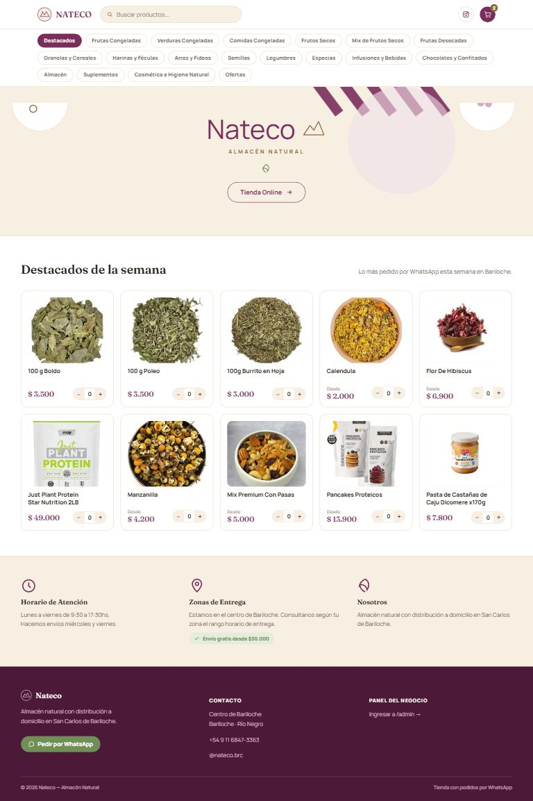
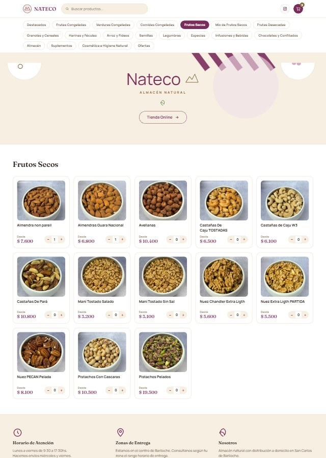
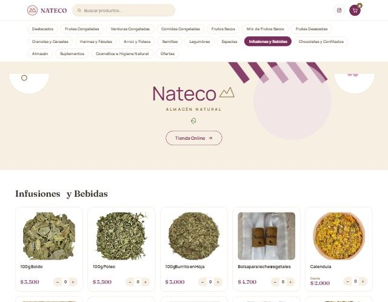
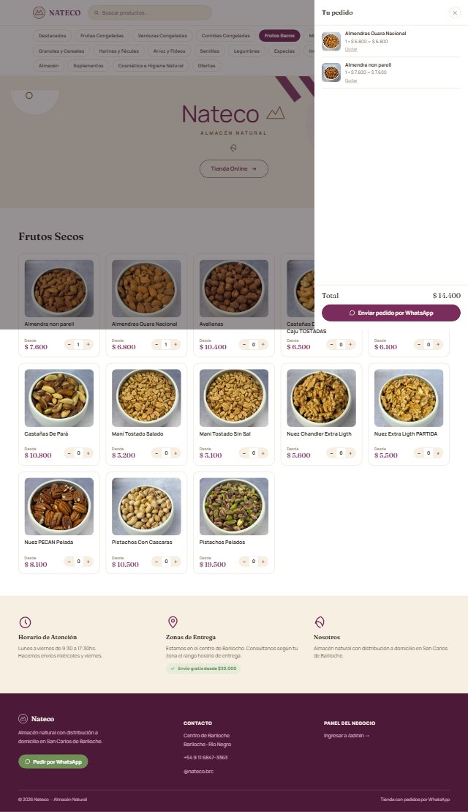
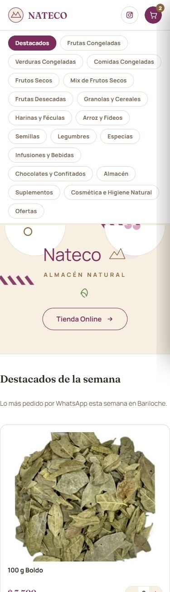

# Nateco — Almacén Natural

Tienda online + panel de administración para un almacén natural de San Carlos de Bariloche. Catálogo de 255 productos reales, checkout por WhatsApp con instrucciones de pago, y un panel `/admin` con dashboard, gráficos de ventas y gestión de stock en tiempo real — todo corriendo sin un servidor propio: **HTML/CSS/JS plano + Supabase** (Postgres, Auth y Realtime), desplegado gratis en Vercel.

<p align="center">
  <a href="https://nateco.vercel.app"></a>
  
  
  
  
</p>

<p align="center"><b><a href="https://nateco.vercel.app">nateco.vercel.app →</a></b></p>

<p align="center">
  
</p>

## Capturas

<table>
  <tr>
    <td width="50%"><br><sub align="center">Catálogo por categoría, con foto real de cada producto</sub></td>
    <td width="50%"><br><sub>18 rubros, buscador que cruza todo el catálogo</sub></td>
  </tr>
  <tr>
    <td width="50%"><br><sub>Carrito → WhatsApp con el pedido y el alias de pago ya redactados</sub></td>
    <td width="50%"><br><sub>100% responsive</sub></td>
  </tr>
</table>

## Qué resuelve

Un almacén chico necesita vender online sin pagar un desarrollo a medida ni un hosting con servidor 24/7. Nateco es una tienda completa —catálogo, carrito, checkout, y un CRM interno— que corre entera como archivos estáticos: el "backend" es Supabase (plan gratis) y las reglas de seguridad viven en Postgres (Row Level Security), no en un servidor que haya que mantener.

## Funcionalidades

**Tienda (`/`)**
- Catálogo de 255 productos reales en 18 categorías, cada uno con su foto.
- Buscador que cruza **todo** el catálogo sin importar la categoría seleccionada.
- Carrito persistente (localStorage) con stepper de cantidades.
- Checkout sin login: pide nombre, teléfono, dirección y nota, y arma un mensaje de WhatsApp con el detalle del pedido, el total y el alias para transferir — negrita incluida.
- El total nunca lo calcula el navegador: lo recalcula un trigger en la base de datos a partir de los productos y cantidades, así nadie puede mandar un total inventado.
- **Asistente de compras con IA** (Gemini): le preguntás qué tenés en texto libre ("tenés frutillas?") y responde con precio y stock real; si no hay un producto, recomienda alternativas parecidas y va agregando todo al carrito a medida que confirmás.

**Panel `/admin`** (login con Supabase Auth)
- **Dashboard**: facturación, ticket promedio, clientes, stock restante y stock bajo, con filtro de fecha (último día / semana / mes / año / rango personalizado).
- Gráficos (Chart.js): ventas por día con agrupación automática por día, semana o mes según el rango; pedidos por estado; top 10 productos más vendidos.
- **Ranking de productos**: buscador y orden por más/menos vendidos, mayor ingreso o stock más bajo.
- **Productos**: código, nombre, categoría, precio, cantidad de stock, "en stock" y destacado, todo editable en línea (se guarda solo al perder el foco), con buscador propio.
- **Pedidos**: en vivo vía Supabase Realtime (con polling de respaldo cada 60s), cambio de estado (nuevo → confirmado → en preparación → entregado / cancelado) y filtro por estado.
- **Clientes**: se arman solos agrupando pedidos por teléfono, sin tabla aparte que se pueda desincronizar.

## Stack

| | |
|---|---|
| Frontend | HTML, CSS y JavaScript sin build ni frameworks — sin `npm install` para correrlo |
| Backend | [Supabase](https://supabase.com) — Postgres, Auth y Realtime (plan gratis) |
| Gráficos | [Chart.js](https://www.chartjs.org/) |
| Asistente / IA | [Gemini API](https://ai.google.dev/) detrás de una función serverless en `api/chat.js`, así la API key nunca queda expuesta en el navegador |
| Seguridad | Row Level Security de Postgres: cualquiera lee productos y crea pedidos; solo el admin lee/edita pedidos y edita productos |
| Hosting | [Vercel](https://vercel.com) — deploy automático desde este repo, sin build command |

## Arquitectura, en dos ideas

1. **No hay servidor propio.** El sitio son archivos estáticos que hablan directo con Supabase desde el navegador con la `anon key` (pensada para ser pública). La seguridad no depende de esconder esa clave, sino de las políticas RLS de `supabase/schema.sql`.
2. **Todo lo sensible pasa por la base de datos, no por el cliente.** El total de un pedido lo calcula un trigger en Postgres; crear un pedido no requiere login pero leerlo o cambiarlo sí; y una función `security definer` (`add_order_rpc.sql`) es la que permite que el checkout público confirme el pedido sin poder leer los de otros clientes.
3. **La única pieza que no es 100% estática es el chat.** `api/chat.js` es una función serverless de Vercel: recibe el mensaje del cliente, lee el catálogo real de Supabase, y recién ahí llama a Gemini con la `GEMINI_API_KEY` guardada como variable de entorno en Vercel — esa clave nunca llega al navegador. Antes de tocar el carrito, valida cada producto que devuelve la IA contra el catálogo real (nunca confía a ciegas en lo que responde el modelo).

## Instalación y despliegue propio

<details>
<summary>Pasos completos (clic para expandir)</summary>

### 1. Crear el proyecto en Supabase

1. Cuenta gratis en [supabase.com](https://supabase.com) y proyecto nuevo.
2. **SQL Editor → New query**, pegá `supabase/schema.sql` completo y, antes de correrlo, reemplazá `admin@nateco.com` por el email real que vas a usar para entrar a `/admin` (aparece 5 veces, en las políticas `..._admin_...`).
3. Ejecutalo: crea las tablas, las políticas de seguridad y un catálogo de ejemplo.
4. Corré, en este orden: `add_image_column.sql` → `products_with_images.sql` (catálogo real de 255 productos con fotos) → `add_stock_qty_column.sql` → `set_default_stock_100.sql` → `add_order_rpc.sql`.

### 2. Crear tu usuario admin

**Authentication → Users → Add user**, mismo email que en el schema, contraseña, y "Auto Confirm User" tildado. Después, en **Authentication → Settings**, desactivá que cualquiera pueda registrarse.

### 3. Completar la config

```js
// js/supabase-config.js
window.SUPABASE_URL = 'https://tu-proyecto.supabase.co';
window.SUPABASE_ANON_KEY = 'tu-anon-public-key';
window.WHATSAPP_NUMBER = '5491168473363';   // sin + ni espacios
window.PAYMENT_ALIAS = 'tu.alias.mp';
window.STORE_NAME = 'Nateco';
```

### 4. Activar el asistente de compras (opcional)

1. Sacá una API key gratis de Gemini en [aistudio.google.com/apikey](https://aistudio.google.com/apikey) (cuenta de Google, sin tarjeta).
2. En tu proyecto de **Vercel → Settings → Environment Variables**, agregá `GEMINI_API_KEY` con esa clave. No va en ningún archivo del repo — la lee `api/chat.js` desde el entorno, así nunca queda expuesta en el navegador.
3. Cada vez que la agregues o la cambies tenés que volver a desplegar (Vercel → Deployments → ⋯ → Redeploy) para que la función la tome.

Si no configurás la key, el resto del sitio funciona igual — el botón del asistente simplemente va a avisar que todavía no está listo.

### 5. Probarlo local

Para la tienda sola alcanza con:

```bash
npx serve .
```

Para probar también el asistente (usa una función serverless en `api/`) hace falta la Vercel CLI, que simula ese entorno:

```bash
npm i -g vercel
vercel dev
```

### 6. Publicarlo gratis

Sin build ni dependencias — se sube la carpeta tal cual. Este repo ya está conectado a **Vercel** (`vercel` CLI, o importar el repo desde vercel.com); el `api/chat.js` se despliega solo como función serverless, no hace falta configurar nada aparte de la variable de entorno del paso 4.

</details>

## Estructura

```
index.html, css/, js/            → tienda (habla directo con Supabase)
js/chat.js                       → widget del asistente de compras
api/chat.js                      → función serverless: catálogo + Gemini, con la API key a salvo
admin/                           → panel /admin (login, dashboard, CRM)
images/products/                 → foto real de cada producto (255 fotos)
docs/screenshots/                → capturas usadas en este README
supabase/schema.sql              → tablas, seguridad y catálogo de ejemplo
supabase/products_with_images.sql → catálogo real completo (255 productos)
supabase/add_order_rpc.sql       → función que crea pedidos sin exponer los de otros clientes
```

## Notas

- **Plan gratis de Supabase**: alcanza de sobra para un negocio chico, pero conviene revisar los límites vigentes en [supabase.com/pricing](https://supabase.com/pricing) antes de asumir que nunca va a hacer falta el plan pago.
- El checkout no cobra ni confirma pagos automáticamente: el cliente transfiere al alias indicado y el admin marca el pedido como "Confirmado" desde el panel al verificar la acreditación.

---

Hecho por [@jsstagno90](https://github.com/jsstagno90).
